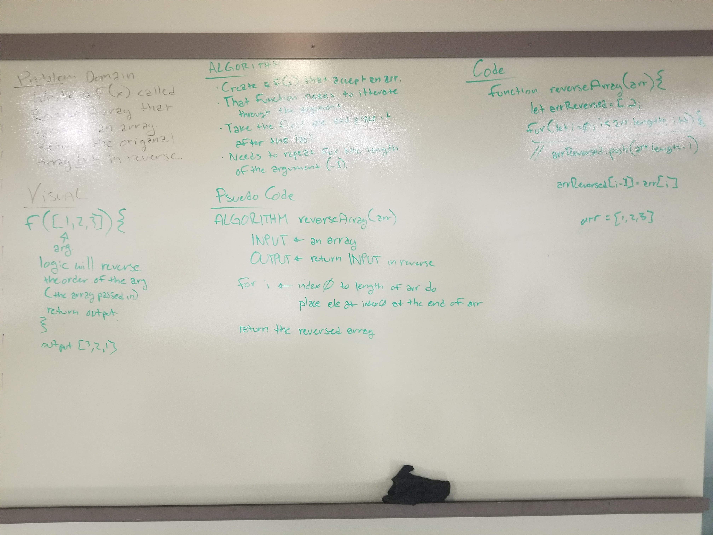

# Revers an Array
write a function that takes in an array as an argument and returns the array in reversed order.

## Challenge
write a function that takes in an array as an argument and returns the array in reversed order.

##Solution
