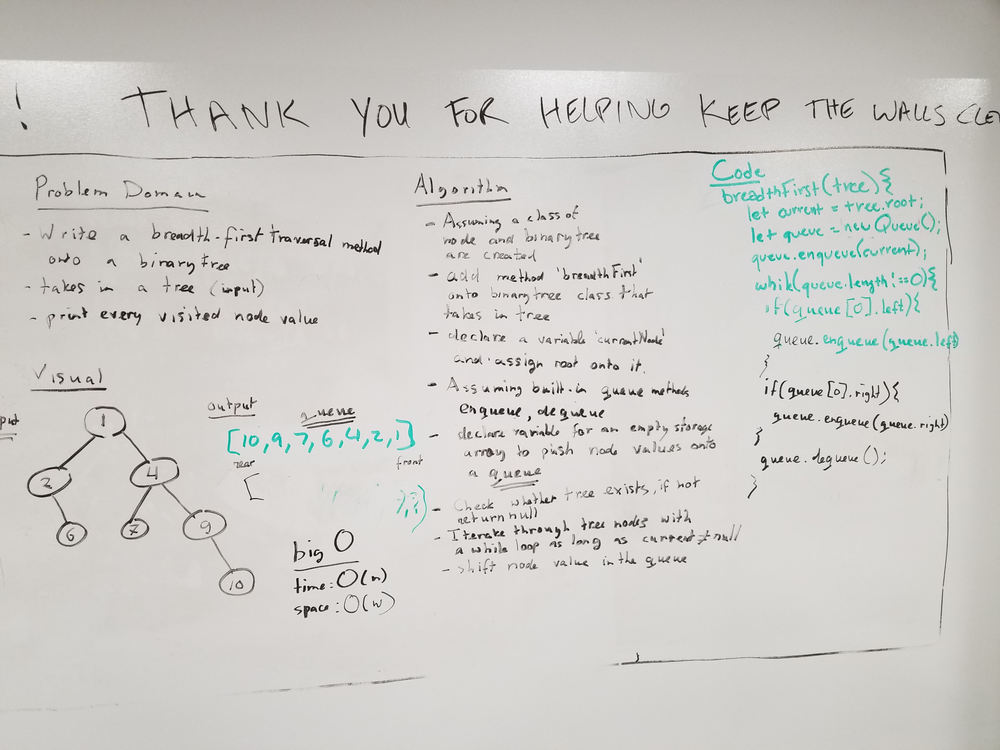

# Breadth-first
Trevor and I were partnered up on this challenge. Tim helped us get to our final solution code.

## Challenge 
Write a breadth first traversal method which takes a Binary Tree as its unique input. Without utilizing any of the built-in methods available to your language, traverse the input tree using a Breadth-first approach; print every visited node’s value.

## Approach and Efficiency
Use a Queue and it's methods we are storing a node from the tree into a queue and looking to see if it has children and if it does we enqueue those children and dequeue the parent. We continue this until there are no more nodes in the tree.

## Big O
Time = O(n)

Space = O(w)

## Solution
