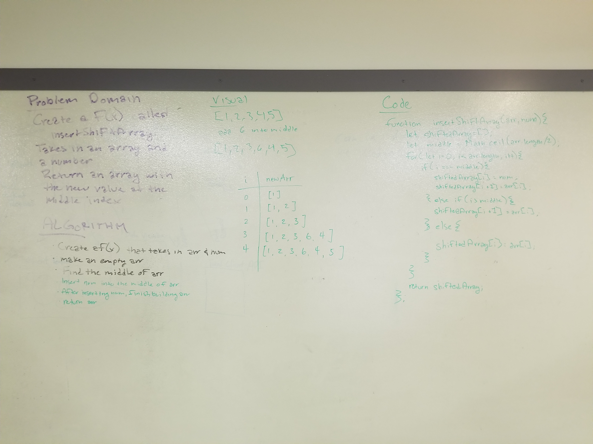

#Insert and shift middle index of an array
- This is a function that should take in an array and a number. The function should return the array with the number in the middle index.

##Challenge
- This is a function that should take in an array and a number. The function should return the array with the number in the middle index.

##Solution
- 