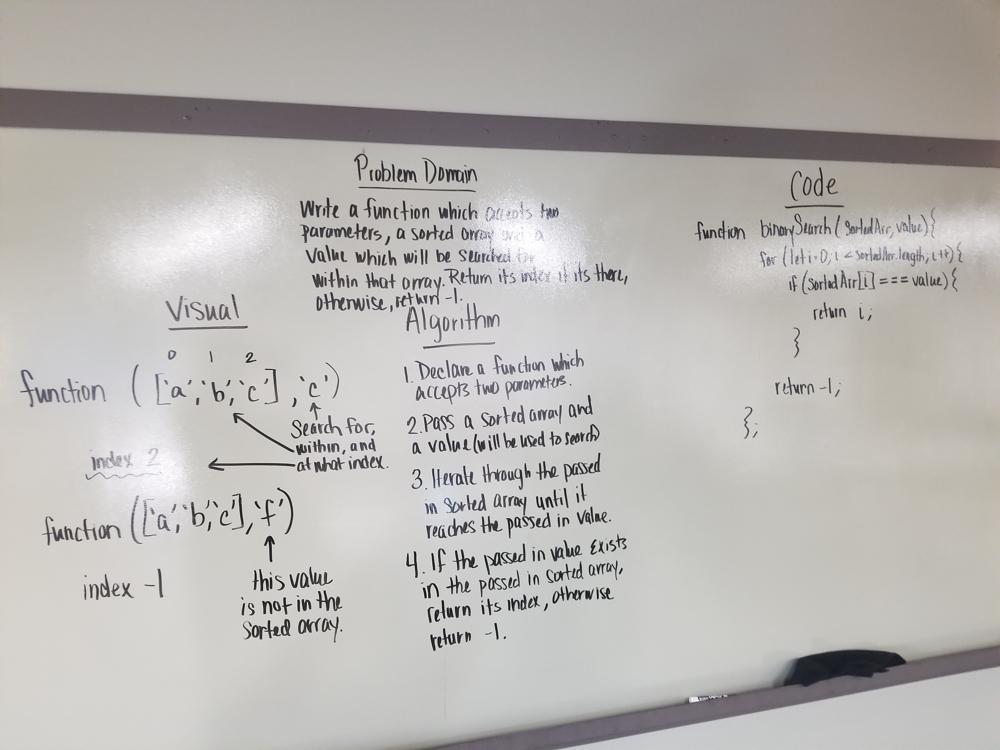

##Search through a sorted array and return the index of a search key, or -1

Write a function called BinarySearch which takes in 2 parameters: a sorted array and the search key. Without utilizing any of the built-in methods available to your language, return the index of the array’s element that is equal to the search key, or -1 if the element does not exist.

#Challenge

This function chould take in a sorted array and a value. The function should iterate over the array and find the passed in value. Once found, return the index of the passed in value. If the passed in value does not exist in the array tha was passed in then return -1.

#Solution
