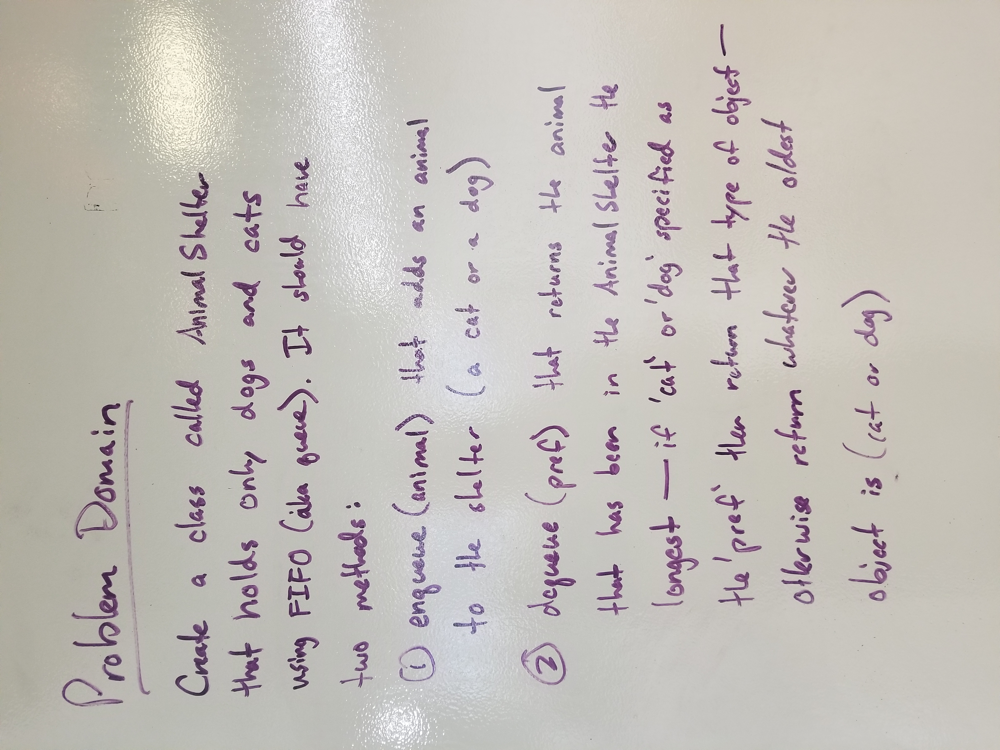
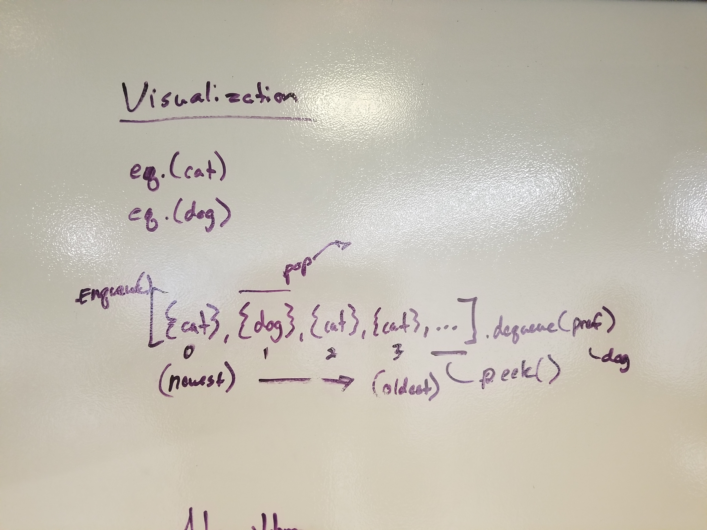
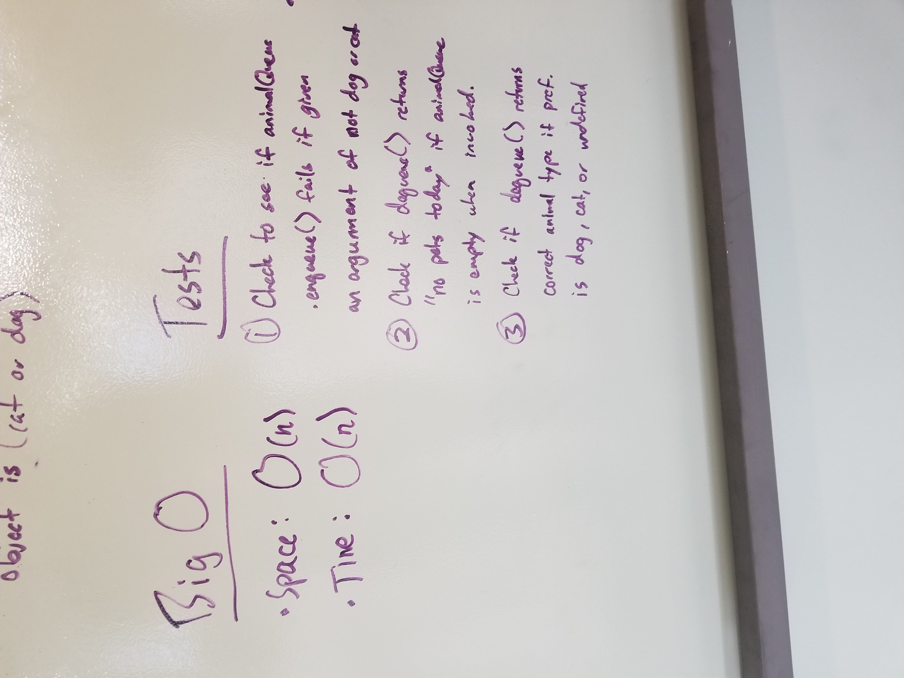
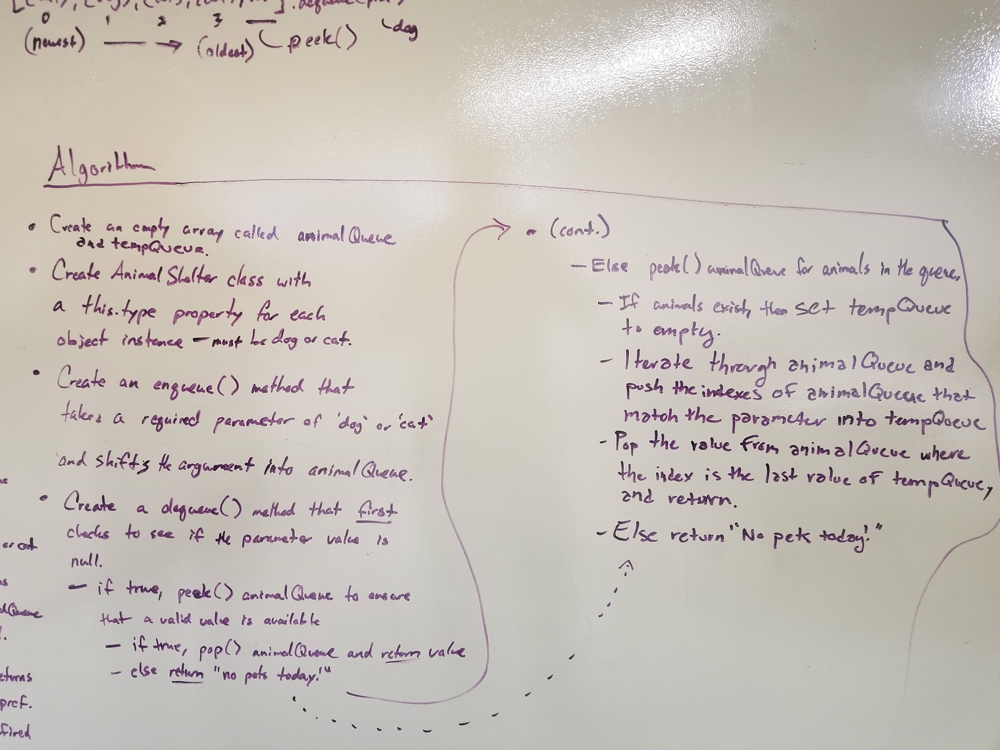
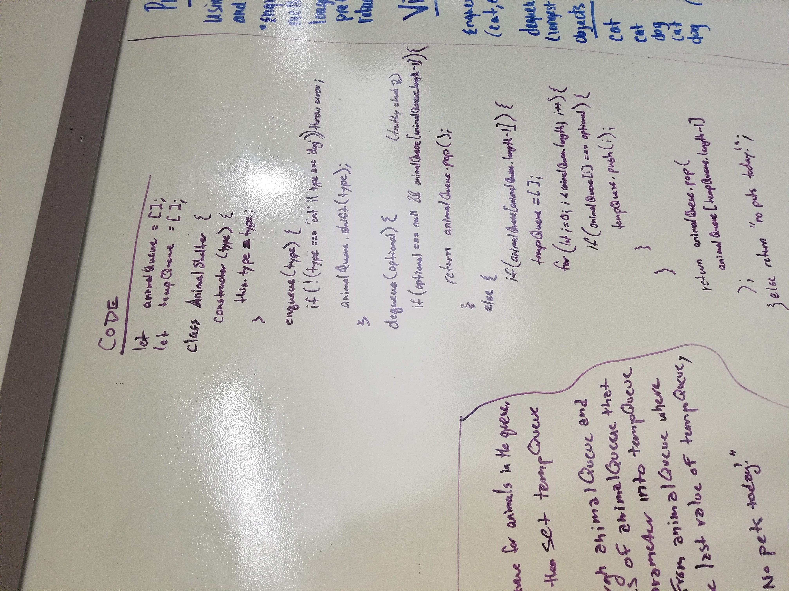

# First in First out Animal Shelter.
Ben and I were partners and we believe we completed it. In an hour no less.

## Challenge
* Create a class called AnimalShelter which holds only dogs and cats. The shelter operates using a first-in, first-out approach.
* Implement the following methods:
* enqueue(animal): adds animal to the shelter. animal can be either a dog or a cat object.
* dequeue(pref): returns either a dog or a cat. If pref, a string, is ‘cat’ return the longest-waiting cat. If pref is ‘dog’, return the longest-waiting dog. For anything else, return either a cat or a dog.

## Approach && Efficiency 
* Create a class called AnimalShelter that holds only dogs and cats using FIFO(aka queue). It should have two methods:
1. enqueu(animal) that adds an animal to the shelter (a cat or a dog).
2. dequeue(pref) that returns the animal that has been in the AnimalShelter the "longest" - if 'cat' or 'dog' is speciffied as the 'pref' then return that type of object - otherwise return whatever the oldest object is (cat or dog).

## Solution

