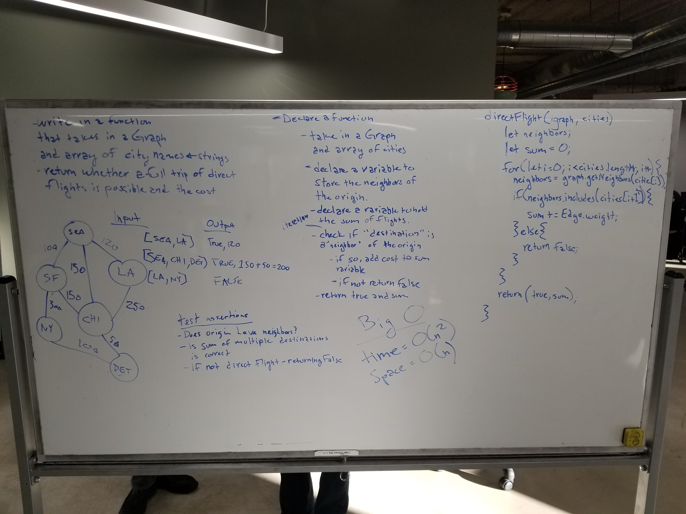

# Get Edges
* Ryan and Trevor

## Challenge
Write a function based on the specifications above, which takes in a graph, and an array of city names. Without utilizing any of the built-in methods available to your language, return whether the full trip is possible with direct flights, and how much it would cost.

## Approach and Efficiency
* Our approach was to get the "neighbors" of the "origin" and see if the next "destination" was included in the "neighbors", if it is we add the weight of the edge (the cost of the flight) to a sum variable otherwise we return false. We continue this process until the passed in array of cities is empty.

## Solution
