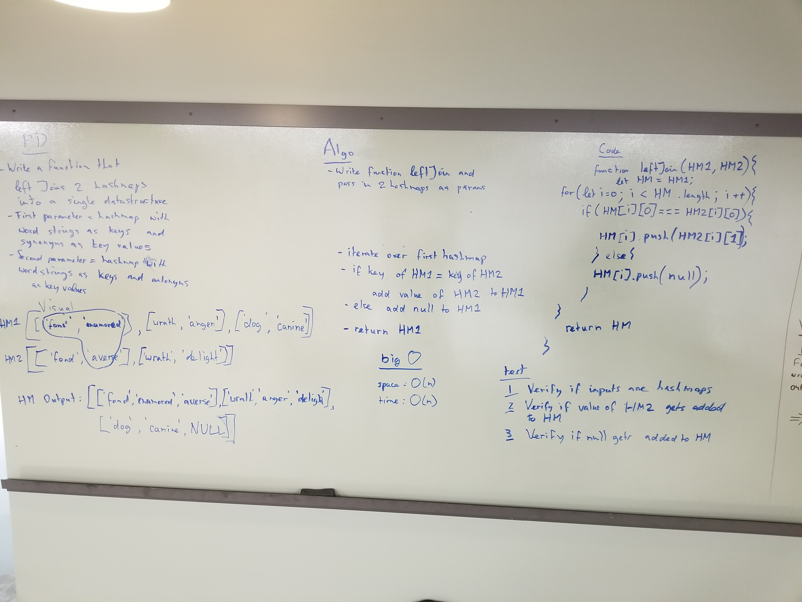

# Left Join

## Partners
Ryan and Trevor

## Challenge
* Write a function that LEFT JOINs two hashmaps into a single data structure.
* The first parameter is a hashmap that has word strings as keys, and a synonym of the key as values.
* The second parameter is a hashmap that has word strings as keys, and antonyms of the key as values.
* Combine the key and corresponding values (if they exist) into a new data structure according to LEFT JOIN logic.
* LEFT JOIN means all the values in the first hashmap are returned, and if values exist in the “right” hashmap, they are appended to the result row. If no values exist in the right hashmap, then some flavor of NULL should be appended to the result row.
* The returned data structure that holds the results is up to you. It doesn’t need to exactly match the output below, so long as it achieves the LEFT JOIN logic.

## Solution

## Approach & Efficiency

* Approach
  * We wrote a function that takes in two HashMaps/HashTables and iterates over the first HashMap. Whilst iterating, it checks to see if the key from the first HashMap exists in the same spot in the second HashMap, if it does it adds the value of said key from the second HashMap to the value of the first HashMap, if not add null to the values of the first HashMap.
* Efficieny
  * Time O(n)
    * We are riterating over the first HashMap and simply checking the same spot to see if that key is present.
  * Space O(n)
    * Space is dependent on the first HashMap length. It will always add onto the fist HashMap.