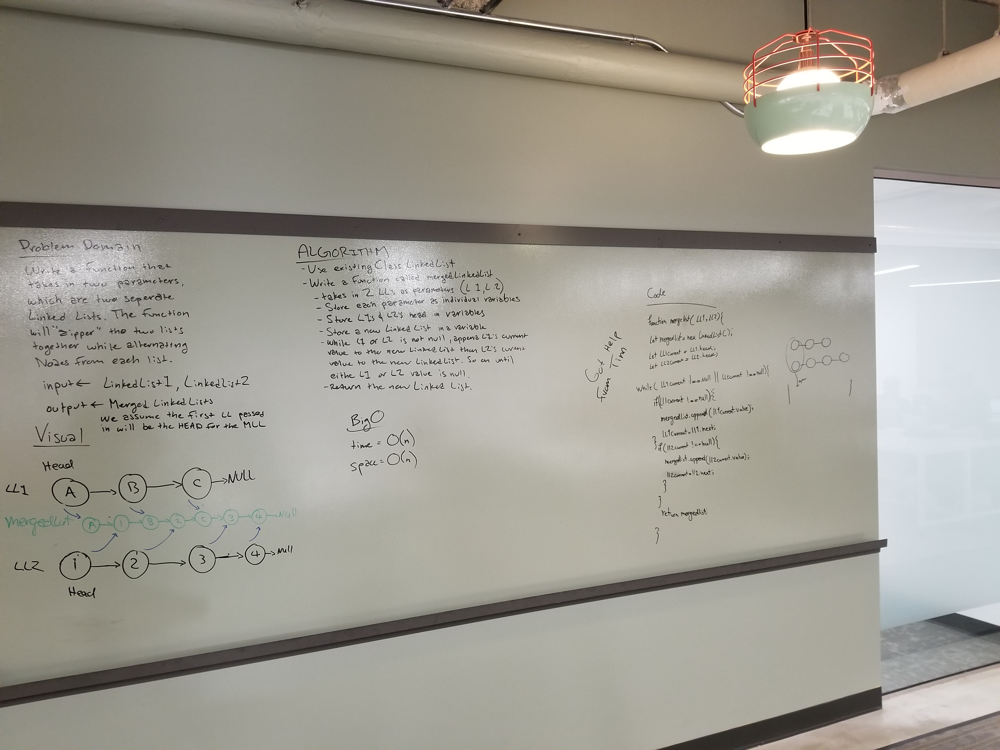

# Merging two Linked Lists
* Ryan and Sarah 
* Our final product was only achieved due to help from Tim Li

## Challenge
* Write a function called mergeLists which takes two linked lists as arguments. Zip the two linked lists together into one so that the nodes alternate between the two lists and return a reference to the head of the zipped list. Try and keep additional space down to O(1). You have access to the Node class and all the properties on the Linked List class as well as the methods created in previous challenges.

## Approach
We created a function that loops through both Linked Lists at the same time. It does this by checking to see if the value of the current Node of each Linked List is null. If it is not null the function will append the value of the current Node to a new Linked List. The function does this for both Linked Lists at the same time. 

## Solution
