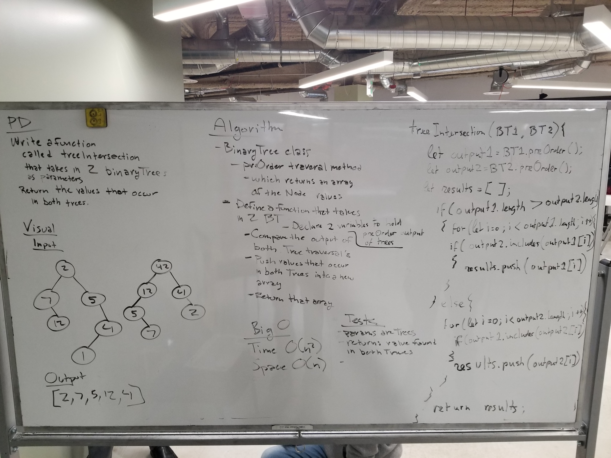

# Tree Intersection

## Partners
Ryan and Trevor

## Challenge
* Write a function called tree_intersection that takes two binary tree parameters.
* Without utilizing any of the built-in library methods available to your language, return a set of values found in both trees.

## Solution

## Approach & Efficiency

* Approach
  * We wrote a function that compared the results from using the preOrder method of a Binary Tree, which returns an array of the Node values, and returns the values that occur in both Trees. An array of the values is returned.
* Efficieny
  * Time O(n^2)
    * We are running a for loop inside of a conditional statement and then another conditional with the .includes method which is looping through the data as well. Therefore O(n^2)
  * Space O(n)
    * The amount of space is dependent upon the size of the Binary Trees being passed in.