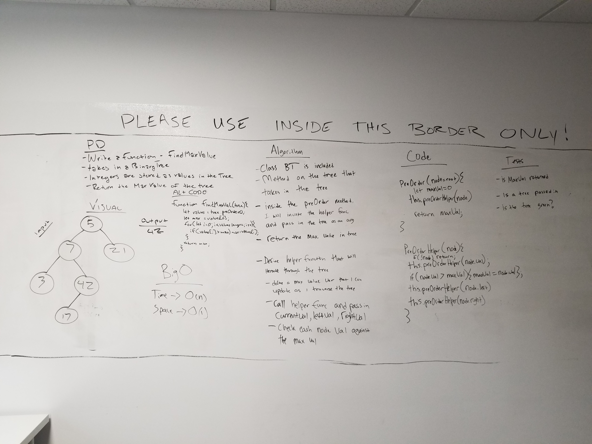

# Trees

## Challenge
To develop working Binary Tree && Binary Search Tree classes with built in methods for ordering, traversing, searching, and adding.

## Approach and Efficiency
With the Binary Tree class I went with the approach of total recurssion and hit it effectively.
With the Binary Search Tree class I used recursion for the add method which adds a value and iteration for the search method (a while loop to be exact).

## Result

# Finding the Max Value in a Tree ------CODE-CHALLENGE-18------------

## Challenge
Write a function called find-maximum-value which takes binary tree as its only input. Without utilizing any of the built-in methods available to your language, return the maximum value stored in the tree. You can assume that the values stored in the Binary Tree will be numeric.

## Approach and Efficiency
With finding the greatest value in a Tree I went with the approach of using a pre existing Binary tree class with a preOrder method available and use the output of the pre Order method (which is an array). I would then iterate through the array and update a variable to the maximum value in said array by comparing the two values.

## Big O

Time O(n)

Space O(n)

## Solution
