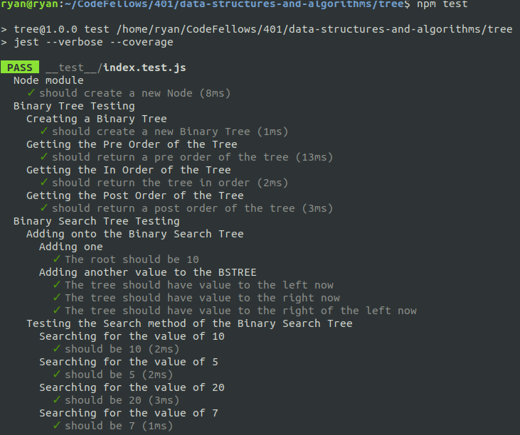

# Trees

## Challenge
To develop working Binary Tree && Binary Search Tree classes with built in methods for ordering, traversing, searching, and adding.

## Approach and Efficiency
With the Binary Tree class I went with the approach of total recurssion and hit it effectively.
With the Binary Search Tree class I used recursion for the add method which adds a value and iteration for the search method (a while loop to be exact).

## Result

